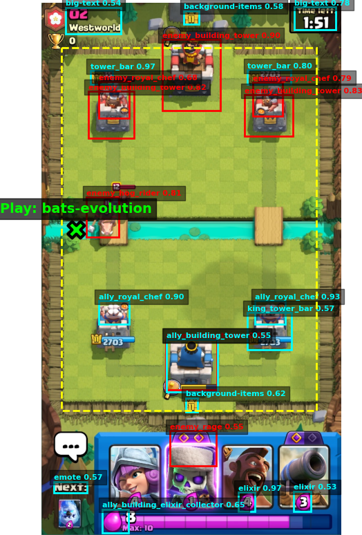
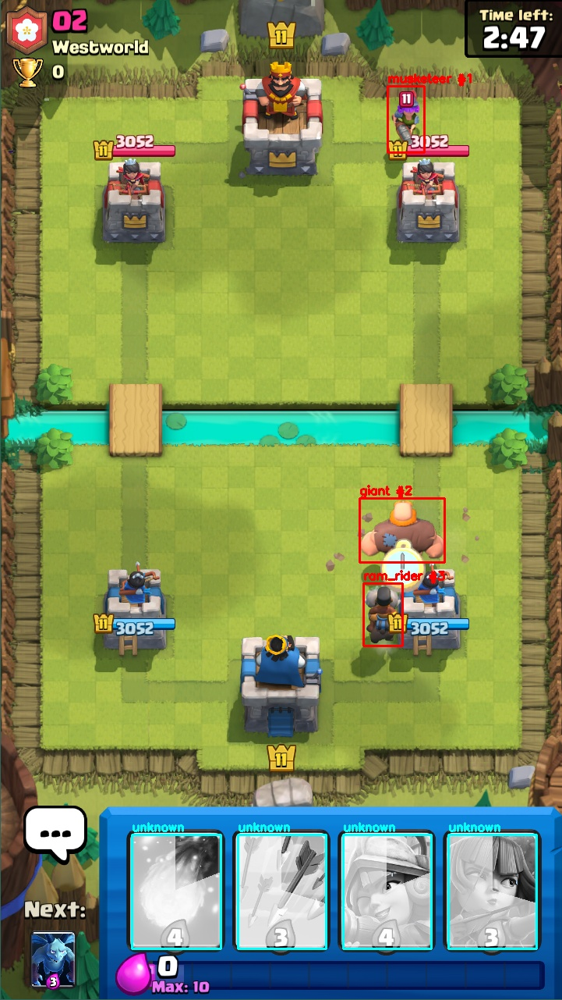

# Clash Royale AI

Computer-vision and offline-RL research project for Clash Royale.  
The repo currently focuses on three parts:

- YOLO-based detection and game-state extraction
- Synthetic dataset generation and YOLO training workflows
- Offline policy learning from replay data (Decision Transformer style)

## Status

This repository is in active development and is not a finished autonomous bot.

- Detection and state extraction are implemented and usable.
- Dataset generation and YOLO training pipelines are implemented.
- Offline RL training pipeline is implemented.
- Experimental automated play/control loop exists for Windows emulator workflows.
- End-to-end live inference plus robust action execution is still in progress.

## Important Notice

This is a personal/research project.

- It is not affiliated with, endorsed by, or associated with Supercell.
- Clash Royale assets and trademarks belong to their respective owners.
- Use this project responsibly and in accordance with game/platform terms.

## Repository Overview

Core directories:

- `detection/`: YOLO wrappers, tower OCR helpers, card classifier tooling.
- `game_state/`: high-level game-state extraction (troops, cards, towers, OCR).
- `dataset/sprites_dataset/`: synthetic dataset builder and source assets structure.
- `scripts/`: training/data utilities (YOLO training, replay collection, dataset checks).
- `policy/`: offline RL pipeline (state/action/reward builders + model + training).
- `tests/`: live detection tests, profiling scripts, setup checks.

Model/data artifacts commonly present in this repo:

- `best.pt`, `yolo11*.pt`: YOLO checkpoints.
- `dataset/*`: synthetic/real dataset variants and YAML metadata.
- `replay_data/`: offline RL replay files (`.xz`, `.pkl`, `.npy`).
- `runs/`: YOLO and policy training outputs.

## Key Features

### 1) Game-State Extraction

`game_state/state_extractor.py` combines:

- YOLO detections for ally/enemy troops/buildings
- Card-in-hand detection via template matching (`detection/card_detector_simple.py`)
- Optional OCR for elixir/timer (Tesseract)
- Troop tracking for temporal consistency
- Optional deck-based filtering

### 2) Synthetic Dataset Builder

`dataset/sprites_dataset/build_synthetic_dataset.py`:

- Composites sprite assets on Clash Royale arena backgrounds
- Supports ally/enemy class variants
- Outputs YOLO-format `train/`, `val/`, `test/` splits + `data.yaml`
- Supports optional CUDA-accelerated compositing with `--use-cuda`

### 3) YOLO Training Pipeline

Primary script: `scripts/train_yolo_synthetic.py`

- Auto dataset detection (or explicit `--data` path)
- Two-stage training option (`--two-stage`) for low-res pretrain then high-res fine-tune
- GPU/CPU auto device selection
- Validation mode support

### 4) Offline RL Training Pipeline

Policy stack under `policy/`:

- Replay collection from video/live capture (`scripts/collect_replay_data.py`)
- State/action/reward builders (`policy/builders/`)
- Replay dataset loader (`policy/offline/dataset.py`)
- Transformer-based policy model (`policy/offline/models/policy_transformer.py`)
- Training entry point (`policy/offline/train.py`)

### 5) Experimental Live Control Loop

There is an experimental runtime controller at `policy/background_controller.py` that:

- Captures emulator frames in real time
- Runs detection plus card recognition
- Selects an action from the policy model
- Sends tap commands through ADB

This is currently an advanced/experimental path and is not yet a polished production bot.

## Visual Examples

Detection and decision overlay:



Live detection frame:



## Quick Start (Windows + venv)

### 1) Install dependencies

```powershell
pip install -r requirements.txt
pip install -r requirements_policy.txt
```

If you need CUDA-enabled PyTorch, install the correct wheel for your CUDA version from PyTorch official instructions.

### 2) Smoke-test live detection

```powershell
python tests/test_live_detection.py
```

This opens the live detection loop and prints extracted state summaries.

### 3) Train YOLO on synthetic dataset

```powershell
python scripts/train_yolo_synthetic.py --mode train --two-stage --model yolo11l.pt --stage1-imgsz 640 --imgsz 960 --stage1-epochs 10 --epochs 50 --batch 16 --device 0
```

If dataset auto-detection picks the wrong folder, pass:

```powershell
python scripts/train_yolo_synthetic.py --data dataset/synthetic_dataset/data.yaml
```

### 4) Collect replay data for policy training

From video:

```powershell
python scripts/collect_replay_data.py --mode video --video recordings/gameplay.mp4 --deck knight archer fireball goblin
```

From live capture:

```powershell
python scripts/collect_replay_data.py --mode live --duration 180 --fps 5 --deck knight archer fireball goblin
```

### 5) Train policy model

```powershell
python policy/offline/train.py --replay-dir replay_data --batch-size 16 --epochs 50 --lr 1e-4
```

Monitor with TensorBoard:

```powershell
tensorboard --logdir runs/policy_training
```

## Main Scripts

- `scripts/train_yolo_synthetic.py`: configurable YOLO training/validation workflow.
- `scripts/train_yolo.py`: fixed high-resolution YOLO training profile.
- `scripts/collect_replay_data.py`: record replay trajectories from video/live gameplay.
- `scripts/train_policy_quickstart.py`: guided offline-RL quickstart helper.
- `tests/test_live_detection.py`: live capture + state extraction sanity test.
- `policy/background_controller.py`: experimental emulator control loop (ADB + policy).

## Configuration Notes

- Primary training metadata is in dataset YAML files (for example `dataset/synthetic_dataset/data.yaml`).
- Runtime/game constants live under `config/`.
- If OCR is used, ensure Tesseract is installed and available on your system.

## Current Limitations

- No polished end-to-end "play a full match autonomously" script yet.
- Replay action labels are currently simplified in collection scripts.
- Model quality is sensitive to dataset quality/class balance.
- Some scripts are tuned for Windows emulator workflows (MEmu/desktop capture).

## Experimental Play Command

If you want to test the current playable loop:

```powershell
python policy/background_controller.py
```

Notes:

- Requires Windows, MEmu window capture, and ADB connectivity.
- Assumes compatible model/checkpoint files are available locally.
- Intended for experimentation and debugging, not stable unattended play.

## Roadmap (High Level)

- Improve replay action annotation quality and dataset diversity.
- Add robust policy inference loop with safety checks.
- Integrate decision output with reliable in-game action execution.
- Expand evaluation harnesses for detection + policy performance.

## Additional Documentation

- Offline RL details: `policy/README.md`
- Integration background: `INTEGRATION_SUMMARY.md`

## Acknowledgment

Offline RL integration was inspired by/adapted from KataCR.
